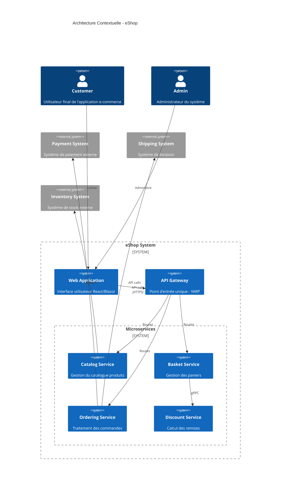

# 🏗️ Vue d'Ensemble Architecture - eShop

## 📖 Introduction

La solution eShop implémente une architecture microservices moderne avec .NET 9, suivant les principes Domain-Driven Design (DDD), CQRS, et Event-Driven Architecture.

## 🎯 Objectifs Architecturaux

### 🎪 Objectifs Métiers
- **Scalabilité** : Support de milliers d'utilisateurs simultanés
- **Disponibilité** : 99.9% d'uptime
- **Performance** : Temps de réponse < 200ms
- **Flexibilité** : Évolution rapide des fonctionnalités

### 🔧 Objectifs Techniques
- **Maintenabilité** : Code modulaire et testable
- **Observabilité** : Logging, métriques, tracing complets
- **Sécurité** : Protection des données et API
- **Déployabilité** : CI/CD automatisé

## 🏛️ Architecture Globale

